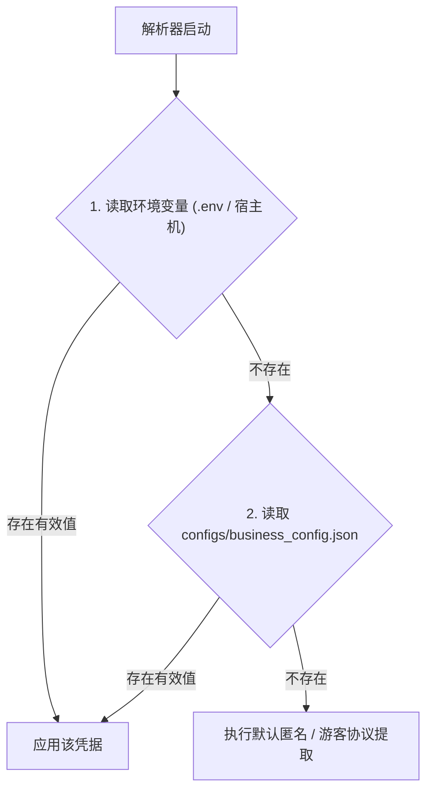

# 全平台 Cookie 与凭证配置指南 (Cookie Configuration Guide)

本文档详细说明 Media Parser 中各平台 Cookie 凭证的作用、获取方式、最小必要字段推荐以及安全配置实践。

---

## 1. 平台凭据矩阵概览

> **核心原则**：本项目 95%+ 的平台**完全无需任何 Cookie 即可直接匿名解析**。仅在特定平台遇到强风控阻断，或提取特定平台的高清原画流时，才需要配置对应 Cookie。

| 平台名称 | 环境变量 Key | 别名支持 | 必要性 / 使用场景 | 推荐精简字段 |
| :--- | :--- | :--- | :--- | :--- |
| **小红书** | `XHS_COOKIE` | `XIAOHONGSHU_COOKIE` | 🟡 **可选 (防风控)**：日常免 Cookie 解析；机房 IP 遭遇 302 登录拦截时配置 | `a1=xxx; webId=xxx; web_session=xxx;` |
| **微信视频号** | `YUANBAO_COOKIE` | `WECHAT_CHANNELS_COOKIE` | 🔐 **必需 (媒体流)**：提取视频号无水印视频流与图集（依赖腾讯元宝接口） | `hy_user=xxx; hy_token=xxx;` |
| **快手** | `KUAISHOU_COOKIE` | `KS_COOKIE` | 🟡 **可选 (防风控)**：日常免 Cookie 解析；触发 `result: 2` 反爬时配置 | `kpf=PC_WEB; kpn=KUAISHOU_VISION; did=xxx;` |
| **拼多多** | `PINDUODUO_COOKIE` | `PDD_COOKIE` | 🟡 **部分依赖**：商品图集免 Cookie；多多视频短视频流解析需要 | `PDDAccessToken=xxx;` |
| **豆包 AI** | `DOUBAO_COOKIE` | - | 🟡 **可选 (无水印)**：公开图文免 Cookie；提取 1080P 无水印视频需要 | `sessionid_ss=xxx;` |
| **即梦 AI** | `JIMENG_COOKIE` | - | 🟡 **可选 (扩展鉴权)**：公开分享免 Cookie；私有草稿/活动页鉴权需要 | `sessionid=xxx;` |
| **微博** | `WEIBO_COOKIE` | - | 🟡 **可选 (防访客限制)**：常规公开博文免 Cookie；机房 IP 遭遇访客拦截或解析粉丝可见内容时配置 | `SUB=xxx;` |
| **抖音** | `DOUYIN_COOKIE` | - | 🟢 **免配置 (100% 免 Cookie)**：日常短视频/图文图集免 Cookie；放映厅长片 (`/lvdetail/`) 可选滑块凭证 | `s_v_web_id=verify_xxx;` |
| **汽水音乐** | `QISHUI_COOKIE` | `QSMUSIC_COOKIE` | 🔐 **VIP 曲目必需**：免费曲目匿名即可解析完整音频；会员曲目匿名只下发 30~60 秒试听片段 | `sessionid=xxx; sessionid_ss=xxx; sid_tt=xxx;` |

---

## 2. 凭证配置方式与优先级

系统支持多种配置渠道，读取优先级从高到低如下：



### 方式 A：通过 `.env` 环境变量配置（推荐，最安全便捷）
在项目根目录创建或编辑 `.env` 文件（参考 [.env.example](file:///Users/leo/Projects/media-parser/.env.example)）：
```env
# 小红书
XHS_COOKIE="a1=xxx; webId=yyy;"

# 腾讯元宝（用于视频号解析）
YUANBAO_COOKIE="hy_user=xxx; hy_token=yyy;"

# 快手
KUAISHOU_COOKIE="did=web_xxx;"

# 拼多多
PINDUODUO_COOKIE="PDDAccessToken=xxx;"

# 豆包
DOUBAO_COOKIE="sessionid_ss=xxx;"
```

### 方式 B：通过 Docker Compose 部署
在 [docker-compose.yml](file:///Users/leo/Projects/media-parser/docker-compose.yml) 所在的目录下编写 `.env`，Docker Compose 启动时会自动将变量注入容器环境：
```bash
docker compose up -d
```

### 方式 C：通过 `configs/business_config.json` 静态配置
可以在配置文件中的 `platform_cookies` 节点下配置（注意：避免将包含个人敏感凭据的文件提交到公开 Git 仓库）：
```json
{
  "platform_cookies": {
    "xhs": "a1=xxx; ...",
    "kuaishou": "did=xxx; ...",
    "pinduoduo": "PDDAccessToken=xxx; ...",
    "yuanbao": "hy_user=xxx; hy_token=xxx; ..."
  }
}
```

---

## 3. 各平台 Cookie 提取步骤 (How-to Guide)

### 3.1 小红书 (`XHS_COOKIE`)
1. 使用电脑浏览器打开 [小红书网页版 (xiaohongshu.com)](https://www.xiaohongshu.com/) 并登录账号。
2. 按 `F12` 打开浏览器开发者工具，切换到 **Application (应用) -> Cookies -> https://www.xiaohongshu.com**。
3. 提取以下核心字段拼装成字符串：
   ```text
   a1=你的a1值; webId=你的webId值; web_session=你的web_session值;
   ```
4. 填入 `.env` 中的 `XHS_COOKIE`。

### 3.2 腾讯元宝 / 微信视频号 (`YUANBAO_COOKIE`)
> 视频号解析依托腾讯元宝的官方智能联网协议，因此需配置腾讯元宝登录态。
1. 使用电脑浏览器打开 [腾讯元宝 (yuanbao.tencent.com)](https://yuanbao.tencent.com/) 并使用微信扫码登录。
2. 按 `F12` 打开开发者工具，切换到 **Network (网络)** 标签页。
3. 在页面上随意发起一次对话或刷新页面，在任意接口请求的 Request Headers 中找到 `Cookie`。
4. 提取其中的核心字段（必须包含 `hy_user` 与 `hy_token`）：
   ```text
   hy_user=你的hy_user值; hy_token=你的hy_token值;
   ```
5. 填入 `.env` 中的 `YUANBAO_COOKIE`。

### 3.3 快手 (`KUAISHOU_COOKIE`)
1. 访问 [快手官网 (kuaishou.com)](https://www.kuaishou.com/)。
2. 打开 `F12` 开发者工具，在 **Application -> Cookies** 中提取：
   ```text
   did=你的did值; kpf=PC_WEB; kpn=KUAISHOU_VISION;
   ```
3. 填入 `.env` 中的 `KUAISHOU_COOKIE`。

### 3.4 拼多多 (`PINDUODUO_COOKIE`)
1. 手机浏览器或 PC 浏览器开启移动端模拟，访问 `mobile.yangkeduo.com`（拼多多 H5 页面）并登录。
2. 在 **Application -> Cookies** 中提取：
   ```text
   PDDAccessToken=你的AccessToken值;
   ```
3. 填入 `.env` 中的 `PINDUODUO_COOKIE`。

### 3.5 豆包 AI (`DOUBAO_COOKIE`)
1. 访问 [豆包官网 (doubao.com)](https://www.doubao.com/) 并登录。
2. 在 **Application -> Cookies** 中找到并提取：
   ```text
   sessionid_ss=你的sessionid_ss值;
   ```
3. 填入 `.env` 中的 `DOUBAO_COOKIE`。

### 3.6 抖音 (`DOUYIN_COOKIE`)
> **核心原则**：常规短视频、图集、LivePhoto、原声音乐等 **100% 免配置 Cookie 即可解析**。

* **常规作品解析**：
  * 常规短视频直连移动端 Feed 免 Argus 门禁通道，毫秒级直出；
  * 普通图文与 LivePhoto 实况作品自动走 Web 详情接口与 SSR HTML 双轨路由：在家庭宽带或住宅 IP 下自动提取实况动图流，在云服务器机房 IP 遭遇风控时自动保底降级为全量无水印高清静态图片，保障服务不报错、稳定可用。
* **放映厅长视频 / 短剧 (`/lvdetail/`)（可选）**：
  * 若需解析受限放映厅长片，可在浏览器完成人机滑块后，在 **Application -> Cookies** 中提取临时凭证 `s_v_web_id=verify_xxx;` 填入 `.env`。代码已实现路由隔离，在解析常规作品时会自动过滤掉过期滑块码，避免误触发风控。

### 3.7 微博 (`WEIBO_COOKIE`)
1. 访问 [微博网页版 (weibo.com)](https://weibo.com/) 并登录账号。
2. 按 `F12` 打开开发者工具，在 **Application -> Cookies -> https://weibo.com** 中提取：
   ```text
   SUB=你的SUB值;
   ```
3. 填入 `.env` 中的 `WEIBO_COOKIE`（用于解决机房 IP 访客限制或提取粉丝可见博文/高码率视频）。

### 3.8 汽水音乐 (`QISHUI_COOKIE`)
> **仅会员曲目需要**。免费曲目匿名解析即为完整音频；会员曲目匿名只返回 30~60 秒试听，必须带 VIP 登录态。
1. 使用电脑浏览器打开 [汽水音乐 (music.douyin.com)](https://music.douyin.com/) 并登录**已开通会员**的抖音账号。
2. 按 `F12` 打开开发者工具，切换到 **Application (应用) -> Cookies -> https://music.douyin.com**。
3. 提取以下核心字段拼装成字符串（`sessionid` 是登录态关键字段）：
   ```text
   sessionid=你的sessionid值; sessionid_ss=你的sessionid_ss值; sid_tt=你的sid_tt值; uid_tt=你的uid_tt值;
   ```
4. 填入 `.env` 中的 `QISHUI_COOKIE`，重启服务。
5. 验证：解析一首会员歌曲，响应里不应再出现 `is_preview: true`，`full_duration` 应等于歌曲完整时长。

---

## 4. 常见错误码与排查指引

当请求的链接触发目标平台风控或凭证失效时，系统会返回明确的 HTTP 400 状态码与结构化 `error_code`：

| 错误码 (`error_code`) | 含义说明 | 解决方案 |
| :--- | :--- | :--- |
| `XIAOHONGSHU_COOKIE_REQUIRED` | 小红书触发服务器 IP 拦截，需要登录 Cookie 校验 | 在 `.env` 中配置或更新 `XHS_COOKIE` |
| `KUAISHOU_COOKIE_REQUIRED` | 快手触发反爬风控校验（`result: 2` / `ANTICRAWL_DEFAULT`） | 在 `.env` 中配置或更新 `KUAISHOU_COOKIE` |
| `WECHAT_CHANNELS_COOKIE_REQUIRED` | 视频号缺少腾讯元宝凭证，无法提取无水印流 | 在 `.env` 中配置有效的 `YUANBAO_COOKIE` |
| `PINDUODUO_COOKIE_REQUIRED` | 拼多多短视频接口返回 403 鉴权失败 | 在 `.env` 中配置最新的 `PINDUODUO_COOKIE` |
| `MEDIA_DELETED_OR_PRIVATE` | 作品已被创作者删除、设为私密或仅自己可见 | 确认源链接是否能在未登录浏览器中公开播放 |

---

## 5. 安全与运维最佳实践

1. **推荐使用小号/测试账号**：
   - 绝不要使用绑有重要资产、支付权限的个人主账号提取 Cookie。
   - 建议注册专门的抓取小号用于日常解析。
2. **凭据隔离与防泄漏**：
   - `.env` 文件已被 `.gitignore` 忽略，请切勿将其提交到公共 Git 仓库。
   - 生产环境推荐通过容器编排环境变量或密钥管理服务注入。
3. **Cookie 定期轮换**：
   - 大部分平台的 Web 登录态有效期在 30~90 天之间；遇到对应平台的 `*_COOKIE_REQUIRED` 报错时，及时在 `.env` 中更新并重启服务即可。
